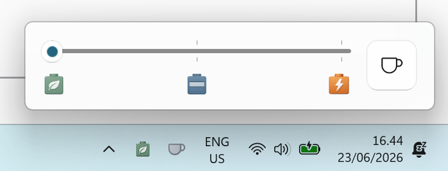

# PowerModeSlider

A lightweight Windows 11 system tray application for quickly switching power modes.


## Overview



PowerModeSlider lives in your system tray and provides a simple slider flyout to switch between Windows 11 power modes instantly—no need to dig through Settings.

## Features

- 🔋 **System Tray App** – Runs quietly in the background
- ⚡ **One-Click Access** – Click the tray icon to show/hide the slider
- 🎚️ **Simple Slider UI** – Drag to switch between three power modes
- ☕ **Keep Awake** – Toggle the coffee button to stop the machine sleeping (ON forever / OFF, no timers)
- 🔄 **Dynamic Icon** – Tray icon updates to reflect current power mode, with an amber badge while keep-awake is on
- 🪟 **Native Look** – Uses Windows 11 Acrylic backdrop

## Power Modes

| Mode | Description |
|------|-------------|
| 🔋 Best Power Efficiency | Saves power by reducing performance and brightness |
| ⚖️ Balanced | Full performance when needed, saves power when idle |
| ⚡ Best Performance | Maximum performance and screen brightness |

## How It Works

The app uses the official Windows Power Management APIs (`PowerSetUserConfiguredACPowerMode` / `PowerSetUserConfiguredDCPowerMode`) introduced in Windows 11 to change power modes for both AC (plugged in) and DC (battery) states.

## Requirements

- Windows 11 (Build 22000 or later)
- .NET 10 Runtime

## Usage

1. Launch the app – it minimizes to the system tray
2. **Left-click** the tray icon to open the power slider
3. Drag the slider to your desired power mode
4. **Right-click** the tray icon to exit

## Development

This project supports the [Windows App Development CLI (`winapp`)](https://github.com/microsoft/winappCli), which lets you build and run the packaged WinUI 3 app directly from the terminal — no Visual Studio required.

### Prerequisites

Install the .NET 10 SDK and the `winapp` CLI:

```powershell
winget install Microsoft.DotNet.SDK.10 --source winget
winget install Microsoft.winappcli --source winget
```

### Run (dotnet run)

The project includes the `Microsoft.Windows.SDK.BuildTools.WinApp` NuGet package, which hooks `dotnet run` into `winapp run` automatically. Run from the `PowerModeSlider/` sub-folder, passing a runtime identifier (the packaged app cannot build as the default `AnyCPU`):

```powershell
cd PowerModeSlider
dotnet run -r win-x64
```

This registers a loose-layout package with Windows and launches the app with full package identity.

### Run (manual winapp)

Build first, then invoke `winapp run` pointing at the build output:

```powershell
dotnet build -c Debug -r win-x64
winapp run .\bin\Debug\net10.0-windows10.0.19041.0\win-x64
```

### Package for distribution (MSIX)

Build in Release, then pack and sign. Because the app's `Package.appxmanifest`
declares `Publisher="CN=gungaretti"`, the signing certificate's subject **must
match** that publisher and **must be trusted** on the machine, or Windows refuses
to install the package (`0x800B010A`). `winapp pack` handles this for you — it
reads the manifest, generates a matching development certificate, trusts it, and
signs the package in one step:

```powershell
dotnet build -c Release -r win-x64
winapp pack .\bin\Release\net10.0-windows10.0.19041.0\win-x64 --generate-cert --install-cert
```

Then install the generated `.msix` (e.g. `Add-AppxPackage .\PowerModeSlider_*.msix`).

Prefer to manage the certificate explicitly? Generate one whose publisher matches
the manifest, trust it, then sign with it:

```powershell
winapp cert generate --manifest .\Package.appxmanifest --install --output .\devcert.pfx --if-exists skip
dotnet build -c Release -r win-x64
winapp pack .\bin\Release\net10.0-windows10.0.19041.0\win-x64 --cert .\devcert.pfx
```

Use `winapp cert info .\devcert.pfx` to confirm the certificate subject matches the
manifest publisher before signing.

> **Tip:** Increment the `Version` in `Package.appxmanifest` before re-packing to allow Windows to update the installed package.

### UI-independent regression tests

```powershell
dotnet test .\PowerModeSlider.Tests\PowerModeSlider.Tests.csproj -c Release -p:TreatWarningsAsErrors=true
```

The 16 dismissal-state and screen-bounds cases compile the same production
sources without loading WinUI or changing system power settings. CI runs them
in an Ubuntu job alongside the existing x64/ARM64 Windows build matrix.
Windows activation and actual mouse/touch input still require runtime checks.

### Manual flyout runtime regressions (baseline RED, fix GREEN)

`scripts\Test-FlyoutDismissal.ps1` tests an external compiled executable using
PowerShell 7 and controlled native windows on an interactive Windows 11 desktop.
It requires neither a new production class nor a unit-test project. The
tests-first layer (#18) leaves production code unchanged: the expected baseline result
is **six behavioral failures and three passing controls**, with
`InfrastructureError` equal to `null`. See [issue #16](https://github.com/giulioungaretti/PowerModeSlider/issues/16)
for the bug investigation. The fixed app must make the **identical, unchanged
harness GREEN: nine passing cases, zero failures, exit 0, and a null
`InfrastructureError`**.

From the repository root, build an isolated unpackaged app and run the harness.
No Visual Studio, `winapp`, package installation, or replacement of an installed
app is needed. These commands target ARM64; on x64, use `win-x64`, `Platform=x64`,
and the corresponding `bin\x64` output path.

```powershell
dotnet build .\PowerModeSlider\PowerModeSlider.csproj --no-restore -c Debug -r win-arm64 -p:Platform=ARM64 -p:WindowsPackageType=None -p:WindowsAppSDKSelfContained=true -p:TreatWarningsAsErrors=true
# If assets/dependencies are missing, rerun the build without --no-restore.
# Choose an existing directory outside the repository for the JSON report.
$resultsPath = Join-Path $env:TEMP 'PowerModeSlider-flyout-results.json'
pwsh -NoProfile -File .\scripts\Test-FlyoutDismissal.ps1 -AppPath .\PowerModeSlider\bin\ARM64\Debug\net10.0-windows10.0.19041.0\win-arm64\PowerModeSlider.exe -ResultsPath $resultsPath
$LASTEXITCODE
Get-Content -LiteralPath $resultsPath
```

The harness launches and stops only its own app process, temporarily controls
foreground windows and the cursor, and attempts to restore both afterward.
Keep the desktop unlocked and avoid interacting with it during the run.
It verifies a visible, foreground flyout and an actual focus switch before
150 ms in each of five early trials, then checks later focus loss. The controls
cover an interior click, a non-activating outside click, and repeated native
`NIN_SELECT` callbacks.

| Exit code | Meaning |
|-----------|---------|
| `0` | All runtime assertions passed. |
| `1` | Valid fixture with behavioral failures (expected RED on unchanged main). |
| `2` | Setup, fixture, or cleanup failure; **not** valid RED evidence. |

For the expected RED result, all five early focus-loss trials and the later
focus-loss trial fail; all three controls pass. Inspect the JSON counts and
`InfrastructureError`, not just the exit code. If desktop interference invalidates
the fixture, retry without changing assertions. Physical tray clicks and touch
remain manual and unverified: the callback control is not a physical tray test.
This interactive suite is not run by hosted CI, so ordinary Windows build checks
can pass while these runtime regressions remain RED. The fixed app handles local
deactivation immediately rather than delaying dismissal for 150 ms, retains the
mouse hook for non-activating targets, and rejects stale queued dismissals after
reopening. Primary owned-tray presses defer dismissal to toggling; release outside
cancels that deferral. Right-click hides the slider before showing its context menu.

## Project Structure

```
PowerModeSlider/
├── PowerModeSlider/    # WinUI 3 tray application
├── PowerModeLib/       # .NET library for power mode APIs
├── KeepAwakeLib/       # .NET library for keep-awake (SetThreadExecutionState)
└── PowerModeSlider.Tests/ # UI-independent dismissal regression tests
```
